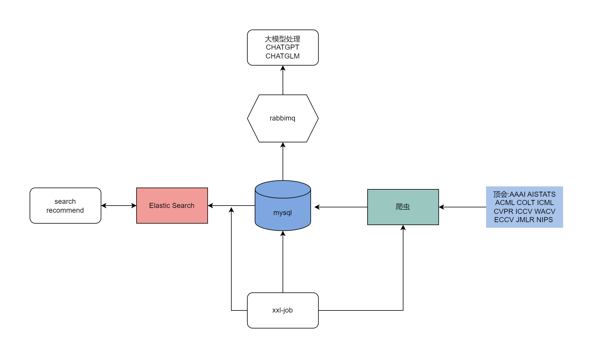

# Paper info

paper info 可以爬取顶会或者arxiv论文，并且利用ChatGPT对论文的关键信息进行理解，然后利用es进行检索，实现用中文检索英文论文，并快速了解论文核心内容。

当然，对于不从事开发工作的用户来说，部署这个项目，会有一点繁琐，本项目提供了爬取的顶会论文，以及解析的文本信息，用户可以将其直接上传至ChatGPT或者国内的大模型的语料库中，也可以实现和论文直接对话的功能。

## 背景

AI计算机领域很多新的成果都是通过论文的形式发出来的，高效的检索，下载和了解论文核心内容对于科研十分重要。在计算机领域，尤其是顶会论文。本人在读研初期，没有及时关注最新的高水平论文，阅读了一些质量不算高或者是方法不够新的论文，浪费了不少时间。随着研究的主键深入，对于在哪里寻找高水平论文才有了进一步的了解。因此，在周末空余实现，根据之遇到的问题，写了这样一个工具。

## 项目实现的功能

1. 使用Jsoup抓取顶会论文和arxiv的论文关键信息。
2. 批量下载论文到本地
3. 使用XEasyPdf解析pdf为纯文本，方便后续处理
4. 调用ChatGPT梳理论文关键信息
5. 使用xxl-job定时任务功能，结合Jsoup检测arxiv最新的论文，紧跟研究方向前沿
6. 使用xxl-job定时定频率地调用api接口，以免频率过高导致调用失败
7. 使用es进行查询，让用户可以直接在众多论文中进行关键词查找，提高了检索速度
8. 封装了调用ChatGPT的接口
9. 封装了调用Google翻译的借口
10. 封装了ChatGPT和Google代理，需要部署在国外服务器上

# 技术方案

## 架构设计

## 项目使用的技术选型

Java8

MySQL8

mybatis-plus

springboot 2.7

elastic search

xxl-job

Jsoup

knife4j

hutool

# 使用方法

## 本地项目部署

1、安装MySQL

2、安装es

3、xxjob(可选)

4、运行项目

可以将自己关注的领域的文章导入（JSON数据链接：https://pan.baidu.com/s/1Y3IlR0N2phD6AlKWfkXAdQ 
提取码：umgd），调用接口进行翻译和核心内容提取。

## 使用ChatGPT等大模型

本项目所积累的数据还可以作为和大模型对话的个人数据，将其上传到大模型中，利用ChatGPT或者阿里云等服务自带的向量数据库，可以直接与论文进行对话。

JSON数据链接：https://pan.baidu.com/s/1Y3IlR0N2phD6AlKWfkXAdQ 
提取码：umgd

### 创建一个ChatGPT助手

1. 进入 https://platform.openai.com/assistants
2. 点击create创建
3. 上传数据

### 使用阿里云

//todo

## 顶会数据量

| 年份 | AAAI | AISTATS | ACML | COLT | ICML | CVPR | ICCV | WACV | ECCV | JMLR | NIPS | sum  |
| ---- | ---- | ------- | ---- | ---- | ---- | ---- | ---- | ---- | ---- | ---- | ---- | ---- |
| 2022 | 1623 | 72      | 83   | 162  | 1232 | 802  | 0    | 406  | 1645 | 351  | 2671 | 9047 |
| 2021 | 1961 | 455     | 115  | 139  | 1183 | 1047 | 836  | 406  | 0    | 289  | 2271 | 8702 |
| 2020 | 1861 | 419     | 54   | 125  | 1081 | 1466 | 0    | 378  | 1358 | 251  | 1897 | 8890 |
| 2019 | 1340 | 359     | 78   | 124  | 771  | 1294 | 1075 | 0    | 0    | 184  | 1426 | 6651 |
| 2018 | 1098 | 216     | 57   | 93   | 618  | 979  | 0    | 0    | 661  | 84   | 1006 | 4812 |
| 2017 | 0    | 167     | 41   | 75   | 431  | 783  | 621  | 0    | 0    | 231  | 677  | 3026 |
| 2016 | 691  | 162     | 29   | 68   | 320  | 643  | 0    | 0    | 0    | 234  | 566  | 2713 |
| 2015 | 673  | 123     | 28   | 77   | 269  | 602  | 526  | 0    | 0    | 118  | 401  | 2817 |
| 2014 | 474  | 121     | 25   | 58   | 302  | 540  | 0    | 0    | 0    | 120  | 406  | 2046 |
| 2013 | 276  | 71      | 32   | 50   | 281  | 471  | 454  | 0    | 0    | 115  | 357  | 2107 |

详细列表见

data/paper/

|                            |        |
| -------------------------- | ------ |
| [top_conference_2013.md]() | 337 kB |
| [top_conference_2014.md]() | 310 kB |
| [top_conference_2015.md]() | 444 kB |
| [top_conference_2016.md]() | 414 kB |
| [top_conference_2017.md]() | 535 kB |
| [top_conference_2018.md]() | 800 kB |
| [top_conference_2019.md]() | 1.1 MB |
| [top_conference_2020.md]() | 1.5 MB |
| [top_conference_2021.md]() | 1.5 MB |
| [top_conference_2022.md]() | 1.5 MB |

# 百度网盘

## pfd文件

链接：https://pan.baidu.com/s/1FKK27KgbYHm_2n5iDy3WZA 
提取码：z8a9

## json文件

JSON数据链接：https://pan.baidu.com/s/1Y3IlR0N2phD6AlKWfkXAdQ 
提取码：umgd

# Q&A

1、项目所部署的机器无法访问ChatGPT和谷歌翻译

A：使用项目中提供的API-Reverse-Proxy模块，将其部署在可以访问的机器上，然后将本地项目调用的接口地址改为代理机器的地址。或者使用国产的替代